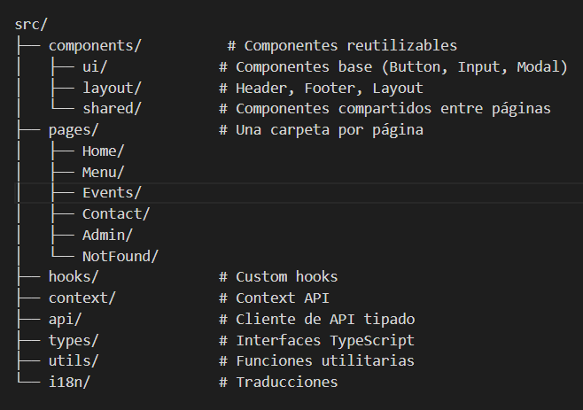

# ARQUITECTURA Y DISEÑO — Casa Vendrell

## Descripción general

Casa Vèndrell es una aplicación web fullstack para un bar de vinos en Barcelona. Tiene dos partes diferenciadas: una web pública para los clientes y un panel de administración privado para los socios del bar.

---

## ESTRUCTURA DE COMPONENTES

La arquitectura de componentes sigue el principio de separación de responsabilidades. Cada carpeta tiene un propósito único y claro, lo que facilita el mantenimiento y la escalabilidad del proyecto.

### components/ui/
Componentes base reutilizables sin lógica de negocio. Son los bloques más pequeños de la interfaz — botones, tarjetas y modales con estilos consistentes que se usan en toda la aplicación.

### components/layout/
Define la estructura visual de la página. El componente Layout envuelve todas las páginas públicas e incluye el Header y el Footer, garantizando una experiencia consistente en toda la web.

### components/shared/
Componentes más complejos que se reutilizan en varias páginas, como las tarjetas de la carta, las tarjetas de eventos, el selector de idioma y los botones de contacto.

### pages/
Una carpeta por página de la aplicación. Cada página usa los componentes anteriores y los conecta con los datos que vienen de los hooks y la API.

---

## GESTIÓN DEL ESTADO

| Tipo de estado | Solución | Justificación |

| Idioma activo | Context API | Necesita ser accesible desde cualquier componente |
| Autenticación admin | Context API + JWT | El token debe estar disponible en toda la app |
| Datos de la carta | useEffect + fetch | Se carga desde la API al montar el componente |
| Datos de eventos | useEffect + fetch | Se carga desde la API al montar el componente |
| Formulario login | useState | Estado local del formulario |
| Loading/Error | useState | Estado local de cada petición |

Se ha elegido Context API en lugar de librerías externas como Redux porque la aplicación no tiene una complejidad de estado que justifique añadir una dependencia adicional. Context API es suficiente para gestionar el idioma y la autenticación.

---

## ENDPOINTS DE LA API

Todos los endpoints siguen el estándar REST. Las rutas de administración están protegidas por JWT — el cliente debe enviar el token en el header 
`Authorization: Bearer <token>`.

| Método | Endpoint | Descripción | Acceso |

| POST | /api/v1/auth/login | Login administrador | Público |
| GET | /api/v1/menu | Obtener carta completa | Público |
| POST | /api/v1/menu | Crear ítem de carta | Admin |
| PATCH | /api/v1/menu/:id | Actualizar ítem de carta | Admin |
| DELETE | /api/v1/menu/:id | Eliminar ítem de carta | Admin |
| GET | /api/v1/events | Obtener eventos | Público |
| POST | /api/v1/events | Crear evento | Admin |
| PATCH | /api/v1/events/:id | Actualizar evento | Admin |
| DELETE | /api/v1/events/:id | Eliminar evento | Admin |

Las RESERVAS no tienen endpoint propio. Se gestionan directamente mediante WhatsApp y email desde la página de contacto.

---

## BASE DE DATOS MYSQL

### Tabla menu_items
| Campo | Tipo | Descripción |

| id | INT AUTO_INCREMENT | Identificador único |
| category | VARCHAR(100) | Categoría del ítem |
| name | VARCHAR(200) | Nombre del plato o vino |
| description | TEXT | Descripción opcional |
| price | DECIMAL(10,2) | Precio en euros |
| available | BOOLEAN | Si está disponible |
| created_at | TIMESTAMP | Fecha de creación |

### Tabla events
| Campo | Tipo | Descripción |

| id | INT AUTO_INCREMENT | Identificador único |
| title | VARCHAR(200) | Título del evento |
| description | TEXT | Descripción del evento |
| date | DATE | Fecha del evento |
| time | TIME | Hora del evento |
| image_url | VARCHAR(500) | URL de la imagen |
| created_at | TIMESTAMP | Fecha de creación |

### Tabla admins
| Campo | Tipo | Descripción |

| id | INT AUTO_INCREMENT | Identificador único |
| email | VARCHAR(200) | Email del administrador |
| password_hash | VARCHAR(500) | Contraseña encriptada |
| created_at | TIMESTAMP | Fecha de creación |

---

## CONTACTO

Las reservas y el contacto se gestionan mediante:
- **WhatsApp principal:** +34 634 938 879
- **Email principal:** reservas.casavendrell@gmail.com
- **Email secundario:** cuatrouvassl@gmail.com

Los datos de contacto están centralizados en `src/utils/contact.ts` para facilitar su modificación sin tocar los componentes.

---

## DECISIONES TECNICAS DESTACADAS

### ¿Por qué React + TypeScript?
TypeScript añade tipado estático al proyecto, lo que reduce errores en tiempo de ejecución y actúa como documentación viva del código. 
Las interfaces de los datos del servidor garantizan que el frontend y el backend están alineados.

### ¿Por qué i18next?
Es la librería estándar de internacionalización para React. Permite gestionar 4 idiomas (ES/CA/EN/FR) con un sistema de archivos JSON simple y un hook `useTranslation` que se integra limpiamente en cualquier componente.

### ¿Por qué Context API y no Redux?
La aplicación tiene dos estados globales simples: el idioma activo y la autenticación del admin. Context API es suficiente para este caso de uso y evita añadir una dependencia externa innecesaria.

### ¿Por qué JWT para la autenticación?
JWT (JSON Web Token) es el estándar para autenticación en APIs REST. El token se genera en el servidor al hacer login y el cliente lo envía en cada petición protegida. No requiere sesiones en el servidor, lo que simplifica el despliegue.